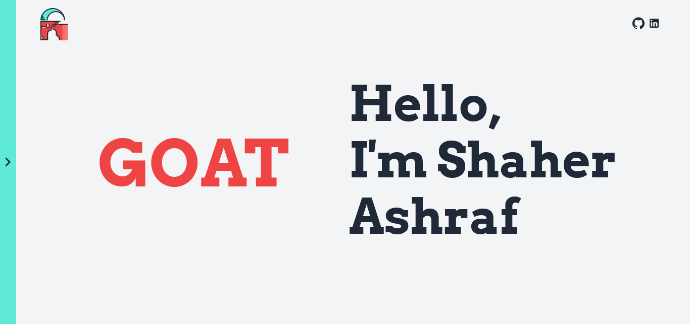

# The GOAT 7 - React portfolio project

## Table of contents

- [Overview](#overview)
  - [Screenshot](#screenshot)
  - [The challenge](#the-challenge)
  - [Links](#links)
- [My process](#my-process)
  - [Built with](#built-with)
- [Author](#author)

## Overview

### Screenshot

### The challenge

Users should be able to:

- View the optimal layout for the site depending on their device's screen size
- See hover states for all interactive elements on the page

### Links

- Live Site URL: [The GOAT 7](https://thegoat7.netlify.app)

## My process

### Built with

- [React](https://reactjs.org/) - JS library
- [Material UI](https://mui.com/) - React UI library
- [Framer Motion](https://www.framer.com/motion/) - React production-ready motion library
- [Smooth Scrollbar](https://idiotwu.github.io/smooth-scrollbar/) - JS Plugin
- [EmailJS](https://www.emailjs.com/) - JS Service

## Author

- Portfolio - [Shaher Ashraf](https://thegoat7.netlify.app)
- Linked In - [Shaher Ashraf](https://www.linkedin.com/in/shaher88223/)
